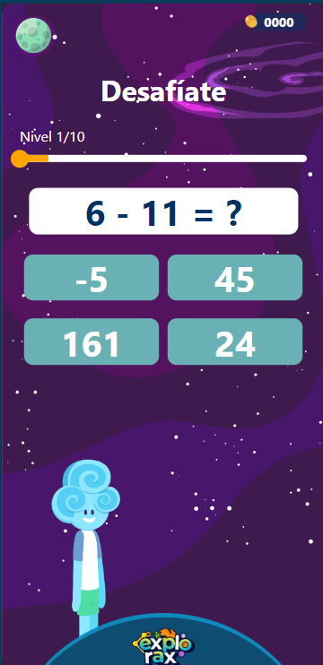

# Explorax_Demo

EXPLORAX es una innovadora plataforma de edutainment transformada en un videojuego interactivo, diseñada para potenciar el aprendizaje a través de la gamificación. Con mecánicas de juego variadas, EXPLORAX ofrece una experiencia inmersiva llena de sonidos, animaciones, y herramientas que mantienen el engagement y la motivación. Los jugadores enfrentan desafíos y retos presentados como misiones, cumpliendo objetivos para avanzar y descubrir nuevos escenarios. Dentro de estas misiones, videos explicativos con jóvenes exploradores brindan ejemplos claros para asegurar una comprensión completa del tema. Las recompensas en forma de monedas acumulables y canjeables por sorpresas enriquecen aún más la aventura educativa.

Nota: Esta es una demo desarrollada para fines técnicos como parte de una prueba técnica para programador frontend.

## Tabla de Contenidos

- [Instalación](#instalación)
- [Uso](#uso)
- [Características](#características)
- [Infraestructura](#infraestructura)
- [Comentario final](#comentario)

## Instalación

Instrucciones detalladas para instalar el proyecto:

```bash
# Clona este repositorio
git clone https://github.com/XaviAlvarado18/Explorax_Demo.git

# Entra al directorio del proyecto
cd Explorax_Demo

# Instalar las dependencias con npm
npm install

# Instalar las dependencias con Yarn
yarn install
```

## Uso

La aplicación puede ser utilizada tanto en versión Web como móvil:

```bash
# Para iniciar la aplicación en formato global
npx expo start

# Para iniciar la aplicación en formato web
npx expo start --web

# Para iniciar la aplicación en formato móvil (IOS)
npx expo start --ios

# Para iniciar la aplicación en formato móvil (android)
npx expo start --android

# Para iniciar usando npm
npm run start

# Para iniciar usando yarn
yarn start

```

## Características

La Demo va a contar con una pantalla de inicio, la cuál nos desafía a completar una misión

(StartedScreen WEB)


(StartedScreen Movil)


(PlanetScreen WEB)


(PlanetScreen Movil)



(ScoreScreen WEB)


(ScoreScreen Movil)


## Infraestructura

La aplicación está desarrollada utilizando **React Native** y **Expo**. Estas tecnologías permiten el desarrollo de aplicaciones móviles multiplataforma, ofreciendo una experiencia de usuario nativa tanto en iOS como en Android. React Native proporciona la capacidad de construir interfaces de usuario utilizando componentes reutilizables, mientras que Expo simplifica el proceso de desarrollo y despliegue con un conjunto de herramientas y servicios integrados.

Algunas características clave de la infraestructura de la aplicación incluyen:

- **Componentes reutilizables:** Permiten construir interfaces de usuario consistentes y mantenibles.
- **Hot Reloading:** Facilita el desarrollo iterativo y la depuración.
- **Acceso a API nativas:** Utilizando Expo, se pueden integrar fácilmente características nativas del dispositivo.
- **Despliegue simplificado:** Con Expo, es posible compartir aplicaciones rápidamente con los equipos de prueba y usuarios.

## Comentario

Quisiera expresar mi comentario acerca de mi breve recorrido en el desarrollo de esta aplicación, este proyecto me hizo recordar mucho a uno que hice para el curso de Programación Orientada a Objetos, en donde utilizando Greenfoot creaba un minijuego de unas naves espaciales, las cuáles tenía que destruyendo para sumar o restar un contador y llegar a un número que el sistema pedía, básicamente era un videojuego para aprender a sumar y restar. 

Estoy conforme con los resultados respecto a las funcionalidades de la aplicación, sin embargo soy consciente de que en cuanto al Responsive en diferentes dispositivos hay un margen de mejora. Traté de hacer uso de buenas prácticas de programación: creando y reutilizando componentes parametrizables, utilizar Dimensions de React Native y porcentajes para las dimensiones de los componentes, implementación de las animaciones, etc.

Agradezco mucho si has leído mi comentario y por tu interés en la demo del proyecto Explorax desarrollada. 


